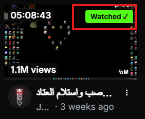

# 🚀 Kick VOD Helper | مساعد كيك

[English] | [العربية](#العربية)

**Kick VOD Helper** is a powerful Chrome extension designed to enhance your viewing experience on Kick.com. It automatically saves your progress in recorded streams (VODs) and marks videos you've already watched.

---

## ✨ Features | المميزات

* **💾 Auto-Resume:** Saves your last position in any VOD and resumes exactly where you left off.
* **✅ "Watched" Badge:** Automatically marks completed videos with a green badge in the listings.
* **🔘 Manual Toggle:** A dedicated button inside the player to manually mark streams as watched.
* **🌐 Dual Language:** Full support for Arabic and English.
* **🔒 Privacy:** All data is stored locally in your browser. No tracking, no servers.

---

## 🛠 Installation | طريقة التركيب

Since this extension is in developer mode, follow these steps to install it:

1.  **Download** this repository as a ZIP file and extract it.
2.  Open your browser and go to `chrome://extensions/`.
3.  Enable **Developer mode** (top right corner).
4.  Click **Load unpacked** and select the folder where you extracted the files.
5.  Enjoy a better Kick experience!

---

## 📸 Screenshots | صور الشرح

| Mark as Watched Button | Watched Badge in List |
|---|---|
|  |  |

---

## 👨‍💻 Developer | المطور

Developed with ❤️ by **Turki Alshaikh** Owner of [Mfatihy Store](https://mfatihy.com)

---

## 🇸🇦 النسخة العربية

**مساعد كيك** هي إضافة متصفح قوية مصممة لتحسين تجربة المشاهدة على موقع Kick.com. تقوم الإضافة بحفظ تقدمك تلقائياً في البثوث المسجلة وتمييز الفيديوهات التي شاهدتها مسبقاً.

### **لماذا تستخدم هذه الإضافة؟**
* **حفظ تلقائي:** لا تقلق بشأن ضياع وقتك عند إغلاق الصفحة، الإضافة ستعيدك لنفس الثانية.
* **تنظيم المشاهدة:** ميز الفيديوهات التي شاهدتها بعلامة خضراء أنيقة.
* **تحكم كامل:** يمكنك تحديد أي بث كـ "تمت المشاهدة" يدوياً من داخل المشغل.

---

## 🤝 Support & Links | الدعم والروابط

* **Store:** [mfatihy.com](https://mfatihy.com)
* **GitHub:** [@turkialshaikh](https://github.com/turkialshaikh)
